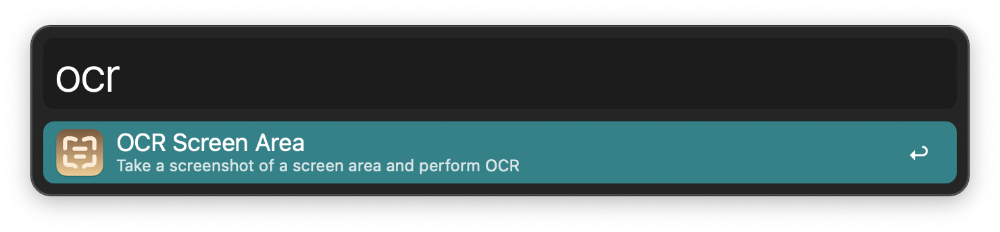
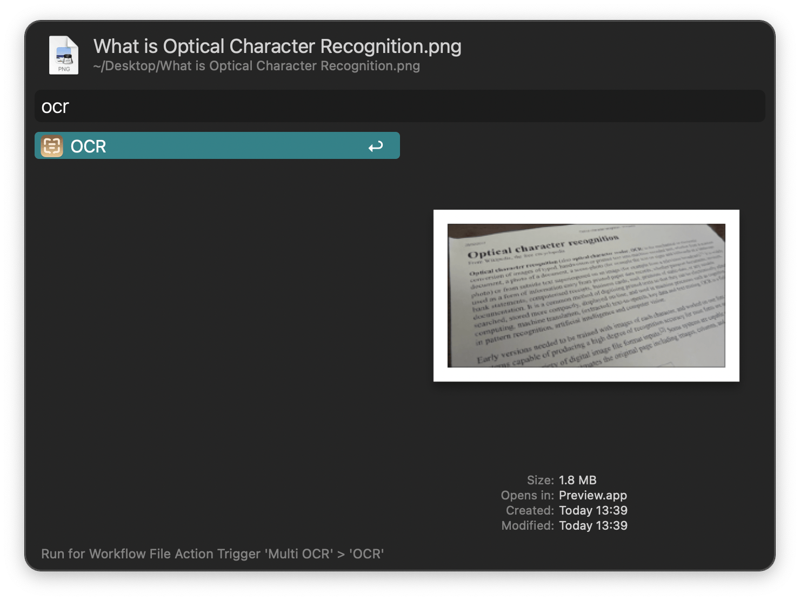
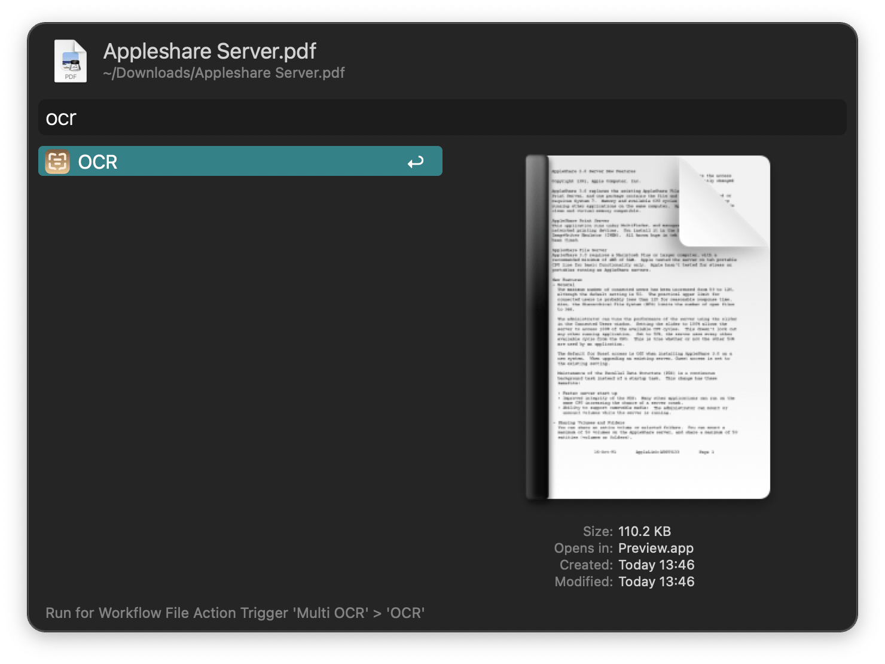

#  Multi OCR Alfred Workflow

Run OCR on screenshots, images, and PDFs

[⤓ Install on the Alfred Gallery](https://alfred.app/workflows/alfredapp/multi-ocr)

## Usage

Perform [Optical Charater Recognition](https://en.wikipedia.org/wiki/Optical_character_recognition) on a screen area via the `ocr` keyword or the [Hotkey](https://www.alfredapp.com/help/workflows/triggers/hotkey/).

Perform Optical Charater recognition on images and PDFs via the [Universal Action](https://www.alfredapp.com/help/features/universal-actions/).

